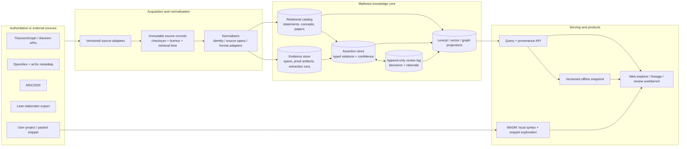

# Mathesis Next Architecture

> Status: proposal / rewrite guide  
> Scope: current Mathesis implementation after the 2026-09 review

## 1. Executive decision

Mathesis Next is **not** a replacement for theorem-search indexes, scholarly
catalogues, Lean, or proof assistants.  It is a *verifiable mathematical
research cockpit*: a system that lets a user move from a query to a statement,
its dependencies, the claimed mathematical relationship, and the exact
evidence and review that justify displaying that relationship.

This changes the product boundary.

- **Reuse** external corpora and extractors for broad coverage: TheoremGraph
  (where its licence and API terms permit it), OpenAlex/arXiv metadata, MSC,
  and elaborator-level Lean exports.
- **Own** the evidence-first enrichment layer: source provenance, relation
  assertions, review workflow, local/offline snapshots, and explanation-first
  navigation.
- **Do not claim** that a text-extracted relation is mathematical truth.  A
  source fact, an automatic proposal, a reviewed claim, and a kernel-verified
  fact are different objects.

The immediate success criterion is not corpus size.  It is that a researcher
can answer, for every visible edge, **“who says this, based on which span or
proof artifact, using which extraction/version, and how certain is it?”**

## 2. What the current system already proves

The present codebase is a valuable prototype rather than throwaway work.

| Existing asset | Keep / change | Reason |
| --- | --- | --- |
| `mathesis-ast` α-normalisation and canonical hashes | Keep, narrow its authority | Useful for local syntax comparison; it is not a substitute for an elaborated Lean term. |
| `mathesis-graph` judgment and dependency model | Migrate its durable concepts | It already distinguishes judgment context, dependency, morphology status, and validation. |
| `mathesis-lean-parse` | Keep as **snippet mode** only | Browser-friendly text parsing is useful for exploration, but source-text splitting must not be an authoritative Lean dependency extractor. |
| `mathesis-taxonomy` | Recast as an enrichment pipeline | Entity resolution, context vectors, and evaluation fixtures are directly useful when their results are treated as proposals with provenance. |
| `mathesis-fulltext` | Keep as an optional source adapter | Its theorem-environment extraction and source-span handling are useful; it should not compete with a global corpus extractor. |
| WASM UI, TeX interpretation, lineage view | Keep and make central | These are the beginning of an explanation-first user experience. |
| Static JSON exports | Retain as an offline snapshot format | They are a deployment projection, not the system of record. |

The current Web README documents two lessons that become architectural rules:

1. Browser search must remain responsive even if a large index is loading.
2. Heuristic relations and extracted text must expose their uncertainty rather
   than silently becoming facts.

## 3. Non-goals and hard boundaries

These boundaries prevent another expensive reinvention of a commodity layer.

1. **No universal crawler as the first milestone.** Mathesis does not begin by
   re-harvesting all of arXiv, rebuilding OpenAlex, or recreating a theorem
   search corpus.
2. **No text parser as a formal authority.** A custom Lean parser may support
   pasted snippets and fallback import, but only a Lean/elaborator-derived
   artifact may establish formal dependencies or verification status.
3. **No automatic acceptance of semantic relations.** An LLM, distributional
   score, naming rule, or Hearst pattern can create a proposal only.
4. **No graph database as an architectural premise.** Start with relational
   adjacency tables, indexed search, and an object store. Adopt a dedicated
   graph store only after measured query requirements demand one.
5. **No proof checker inside Mathesis.** Mathesis stores links to proof
   artifacts and checker results; Lean/Coq/Isabelle remain the authorities for
   proof validity.

## 4. Target architecture



### 4.1 The key separation: records, assertions, and decisions

The current architecture tends to make a graph edge carry several meanings at
once.  Mathesis Next must use three separate layers.

| Layer | Example | May it be used for inference? |
| --- | --- | --- |
| **Source record** | “Paper X contains a `\begin{theorem}` at line 102.” | Yes, as a fact about the source. |
| **Assertion** | “`A specialization_of B`, proposed by a Hearst pattern.” | No, until its policy permits it. |
| **Review decision** | “Reviewer R accepted this assertion for dataset release V.” | Yes, only within the declared review policy. |

A formal dependency exported by Lean is a source record with a high-assurance
provenance class.  It is still not the same thing as a semantic statement such
as “these two theorems are equivalent.”

This avoids the most dangerous modelling error: storing *proof dependency*,
*semantic implication*, *lexical similarity*, and *human belief* as one generic
edge type.

### 4.2 Confidence is not truth

Every visible relationship has both a **kind** and an **epistemic state**.

```text
relation kind:     depends_on | imports | cites | specializes | equivalent_to |
                   generalizes | related_to | uses_concept | implies

epistemic state:   observed | extracted | proposed | reviewed | verified | rejected
```

> `implies` was added 2026-09-05 during the Phase 1 migration
> (`docs/DATA_DICTIONARY.md`): a semantic entailment claim (A ⟹ B) asserted
> by a human or heuristic, distinct from `depends_on`'s mechanically
> observable "this proof's text references that judgment." Keeping them
> separate avoids merging two different kinds of claim under one predicate,
> per this section's own warning below.

- `observed`: directly present in an imported source, such as a citation or a
  Lean-exported dependency.
- `extracted`: deterministically extracted from a source span, but not yet
  reviewed for meaning.
- `proposed`: generated by a heuristic or model; never part of trusted graph
  traversal by default.
- `reviewed`: an accountable human decision with an explanation and scope.
- `verified`: checked by the appropriate proof assistant or a deterministic
  formal validator.  It applies to formal claims only.
- `rejected`: retained as a negative review result so the system does not keep
  proposing the same known-bad relation.

The UI must never label `confirmed` without explaining *what* was confirmed.
For example, “two detectors agree” is not “mathematically verified.”

## 5. Data model

All identifiers are stable, opaque IDs. Display names, source identifiers, and
normalised keys are attributes rather than primary keys.

### 5.1 Immutable source envelope

```text
SourceRecord
  id, provider, provider_id, provider_revision
  retrieved_at, content_hash, licence, attribution, raw_payload_uri
  adapter_name, adapter_version, parser_version
```

The raw payload may be retained only where the source licence and deployment
policy allow it. Otherwise Mathesis keeps a hash, a locator, and the minimum
permitted derived data.

### 5.2 Research objects

```text
Paper
  id, canonical_external_ids[], title, publication metadata

Statement
  id, paper_id?, formal_system?, formality
  display_body, source_locator, source_record_id
  canonical_form_id?, external_statement_ids[]

Concept
  id, preferred_label, aliases[], msc_links[]
  identity_policy_version

ProofArtifact
  id, statement_id, checker, checker_version, artifact_locator
  verification_result, dependency_manifest_hash
```

`canonical_form_id` is optional.  A failed or partial parse is useful data and
must not be silently converted into a valid formal expression.

### 5.3 Evidence-backed assertion

```text
RelationAssertion
  id, subject_id, predicate, object_id
  epistemic_state, score?, policy_version
  created_by_run_id?, supersedes_id?

Evidence
  id, assertion_id, source_record_id, locator
  evidence_kind: source_span | formal_export | model_output | reviewer_note
  extractor_or_model, version, input_hash, output_hash

ReviewDecision
  id, assertion_id, decision, reviewer_id, scope
  rationale, decided_at, dataset_version
```

The `Evidence` table is mandatory for every assertion other than a manually
authored note. A reviewer cannot accept an edge whose evidence cannot be shown.

### 5.4 Versioning model

Use append-only runs and releases.

```text
source snapshot -> normalisation run -> enrichment run -> review set -> release
```

No release mutates prior records. A release manifest lists source versions,
adapter versions, model IDs, parameters, review-policy version, and evaluation
results. This makes a shared link and an offline bundle reproducible.

## 6. Compute and storage choices

### 6.1 Default server / collaboration profile

| Need | Initial technology | Upgrade condition |
| --- | --- | --- |
| Catalog, assertions, reviews, adjacency | PostgreSQL | Keep until measured recursive graph queries or write rates fail. |
| Full-text and exact search | Tantivy service or PostgreSQL FTS | Use a separate search service only after measured latency/recall need. |
| Vectors | `pgvector` or an external vector index behind an interface | Add ANN infrastructure only when corpus size makes exact/offline candidates insufficient. |
| Large raw/import payloads | Object storage with checksums | Store only licensed material. |
| Batch work | Rust worker processes plus a durable run table | Introduce a queue/orchestrator only when concurrent jobs require it. |

Do not introduce Neo4j, Qdrant, a microservice mesh, or a rule engine merely
because the target diagram has a graph. Each is an earned optimisation.

### 6.2 Local / offline profile

An offline bundle is a **signed projection of one release**, not a separately
maintained database.

```text
release manifest
  + SQLite read model (cards, statements, assertions, evidence locators)
  + compressed lexical-index shards
  + optional local vector/neighbor shards
  + static assets and WASM helpers
```

The existing static JSON and Web Worker approach is a good first projection.
Move it behind a bundle exporter so that browser and server results share the
same release ID and semantics.

## 7. Query and user experience contract

Every query composes several deliberately distinct operations:

1. **Retrieve** statements/concepts/papers by lexical and optional semantic
   search.
2. **Resolve** aliases and source identities, while displaying the resolution.
3. **Traverse** only edge states allowed by the user's trust policy. Default:
   observed formal dependencies and reviewed semantic assertions; proposed
   edges are opt-in.
4. **Explain** each result with source, evidence span, assertion state, run
   version, and reviewer decision.
5. **Act**: compare, bookmark, annotate, accept/reject, or export a cited view.

The lineage view remains the flagship interaction, but its edges should be
visually separated:

| Edge visual | Meaning |
| --- | --- |
| solid | observed/verified dependency |
| coloured solid | reviewed semantic relation |
| dashed | extracted or proposed relation |
| muted | contextual similarity; never a derivation |

WASM remains responsible for instant TeX display, local syntactic
normalisation, and pasted-snippet exploration. It does not independently
reimplement server graph policy.

## 8. Rust workspace transition

Target logical packages (names are suggestions, not a requirement to create all
crates at once):

```text
mathesis-domain/          IDs, domain types, relation vocabulary, policies
mathesis-ast/             local formula representation and normalisation
mathesis-provenance/      source envelopes, spans, run/release manifests
mathesis-catalog/         persistence ports and PostgreSQL/SQLite adapters
mathesis-adapter-*/       theoremgraph, openalex, msc, lean-export, local-file
mathesis-enrich/          ER, concepts, relation proposal jobs
mathesis-curation/        review decisions and publication policy
mathesis-query/           retrieval, trust-aware traversal, explanation DTOs
mathesis-bundle/          offline release exporter and verifier
mathesis-api/             HTTP API and authentication boundary
mathesis-web/             user interface
mathesis-wasm/            syntax/snippet helpers only
```

Existing code moves by responsibility rather than by a large-bang rewrite:

| Current crate | Destination |
| --- | --- |
| `mathesis-msc` | `mathesis-adapter-msc` or a stable data module |
| `mathesis-ingest` | source adapters plus provenance storage |
| `mathesis-fulltext` | `mathesis-adapter-arxiv-source` with explicit extraction confidence |
| `mathesis-taxonomy` | `mathesis-enrich`; keep its deterministic parts and fixtures |
| `mathesis-graph` | migrate data types and validation rules into `domain`/`catalog` |
| `mathesis-lean-parse` | `mathesis-wasm` snippet dependency; not the authoritative import path |
| `mathesis-importer` | compatibility adapter that produces source records and assertions |

For the first releases, a **legacy snapshot adapter** should import existing
`taxonomy*.json` and `judgments.json` into the new model with clearly marked
provenance. This preserves the current site while replacement views are built.

## 9. Ingestion policy

Adapters must satisfy a common contract:

```text
discover -> fetch -> checksum -> persist source record -> normalise
         -> emit domain records + evidence -> validate -> publish run report
```

Each adapter has fixtures from real sources, contract tests, retry/backoff,
deduplication, an explicit rate-limit policy, and an attribution/licence field.
No adapter writes a reviewed relation directly.

Priority order:

1. **MSC adapter**: controlled vocabulary and stable links.
2. **OpenAlex adapter**: paper identity, metadata, citation context where
   available; use it as a canonical metadata supplement rather than a new
   crawler.
3. **TheoremGraph adapter**: statement/dependency retrieval subject to licence,
   API stability, attribution, and provenance compatibility review.
4. **Lean exporter adapter**: elaborator-derived dependency manifests for
   selected projects, with compiler and package-lock versions recorded.
5. **Local source adapter**: a researcher’s own Lean/LaTeX project, where
   Mathesis can add private, local-first value.

## 10. Curation is the moat

The first multi-user feature should be a review workbench, not a new crawler.

For every proposed relation, reviewers see:

- the two objects with disambiguating context;
- the exact evidence sentence or formal artifact;
- the extraction/model version and score;
- previous decisions and contradictory assertions;
- accept, reject, split, merge, and “needs expert” outcomes;
- the scope of the decision (local project, shared workspace, or released
  public dataset).

Review decisions create events; they do not overwrite the original proposal.
This produces a high-quality, inspectable dataset over time and makes Mathesis
useful even when its upstream corpora are commodity infrastructure.

## 11. Evaluation and release gates

The current 40-query evaluation is a good regression seed, not a quality claim
for mathematical search as a whole. Create a versioned benchmark with strata
for MSC fields, query forms, aliases, formal/informal cross-links, and relation
types.

Every release must publish:

| Gate | Minimum evidence |
| --- | --- |
| Source freshness | source snapshot IDs and adapter success/failure counts |
| Determinism | repeated run gives the same record hashes when inputs match |
| Retrieval | MRR/Recall by stratum, not only an aggregate score |
| Entity resolution | sampled precision and recall, including false merges |
| Relations | precision/recall by predicate and epistemic state |
| Formal imports | manifest completeness and checker-version compatibility |
| UI integrity | every displayed edge resolves to an evidence record |
| Offline parity | bundle query outputs match its declared release |

LLM usage, if any, must record model identifier, prompt-template hash, input
hash, output hash, and decision policy. It may reduce review workload but must
not become an untraceable source of accepted mathematical facts.

## 12. Migration plan

### Phase 0 — Freeze and measure (1–2 weeks)

- Tag the existing application and retain its public JSON as a reproducible
  baseline release.
- Correct documentation drift: the root README must link to the current Web
  architecture; record actual corpus counts at release time.
- Define the relation vocabulary and epistemic states before moving data.
- Turn the current search and relation fixtures into the first benchmark
  release.

**Exit:** a written data dictionary and a versioned baseline manifest exist.

### Phase 1 — Build the evidence core (2–4 weeks)

- Create `SourceRecord`, `Evidence`, `RelationAssertion`, `ReviewDecision`,
  and release-manifest schemas.
- Add a legacy snapshot adapter for current taxonomy and judgment exports.
- Serve the current Web lineage/search views from the new read model without
  changing the user experience.

**Exit:** each current visible edge can be traced to a legacy source record and
release ID.

### Phase 2 — Integrate, do not duplicate (3–6 weeks)

- Implement MSC and OpenAlex adapters first.
- Perform a legal/technical compatibility review before a TheoremGraph adapter.
- Add an elaborator-derived Lean import path for one selected project; compare
  its manifest with the present text-parser output.

**Exit:** one query can show upstream records and local enrichments side by
side, without asserting they are identical.

### Phase 3 — Curation and trust-aware exploration (4–8 weeks)

- Add review events, evidence pages, reviewer roles, and release policies.
- Make graph traversal default to observed/verified/reviewed edges.
- Show proposed relations only behind an explicit UI control.

**Exit:** a reviewer can correct a relation without changing source data, and
the correction appears in a new release with a rationale.

### Phase 4 — Offline bundle and focused enrichment (ongoing)

- Export signed, sharded offline releases from the same server-side manifest.
- Improve entity resolution and concept/relation proposals only where review
  data demonstrates a real gap in upstream sources.
- Add proof-strategy and minimal-dependency analyses only for formal artifacts
  whose provenance and checker constraints are known.

**Exit:** the local bundle and hosted API agree on release semantics; no
separately maintained browser-only graph logic remains.

## 13. Decisions deliberately deferred

- Dedicated graph database selection.
- Vector database selection and embedding model selection.
- Cross-assistant semantic equivalence (Lean/Coq/Isabelle).
- Automated equivalence/generalisation acceptance.
- Storage of copyrighted full text and proofs.
- Public collaborative editing and identity model.

Each should be decided from observed query patterns, licensing constraints, and
review throughput—not anticipated scale alone.

## 14. Architectural invariants

1. **Every user-visible mathematical relation has provenance.**
2. **No proposal becomes a trusted inference edge without policy-governed
   review or formal verification.**
3. **External identifiers and source revisions are never discarded.**
4. **A local/offline result identifies the exact release that produced it.**
5. **UI convenience never hides parse failure, uncertainty, or source scope.**
6. **Lean and other proof assistants remain the validators of formal proof.**
7. **Mathesis’s durable advantage is inspection and curation, not replication
   of broad corpus infrastructure.**

